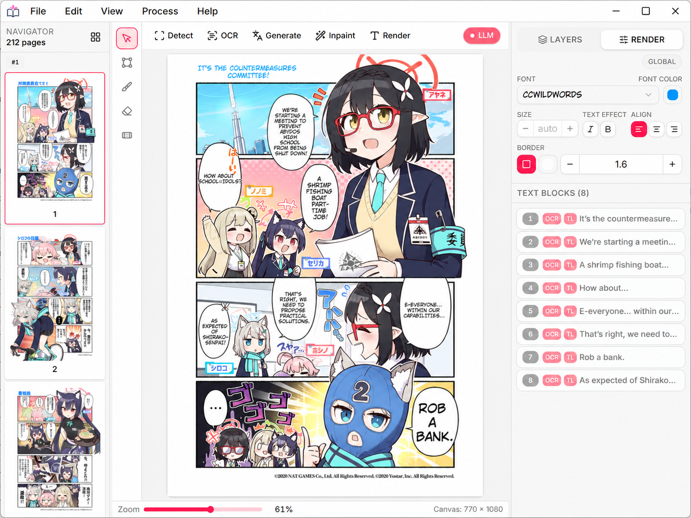

  <section class="ym-hero">
    

      

        

          Now available:
          llama.cpp local inference
          
            Run GGUF models locally with CUDA, Vulkan, or Metal acceleration.
          
        

      

      

        <h1>Translate and typeset manga with a local-first production pipeline.</h1>
        

          Yomika handles OCR, cleanup, translation, review, and export on Windows,
          macOS, and Linux. Run the built-in vision pipeline and downloaded LLMs
          on-device, or opt into a hosted translation provider.
        

        

          
Local models include

          

            sakura
            vntl-llama3
            hunyuan
            lfm2
          

        

        

          <a class="ym-download-button" href="how-to/build-from-source.md">
            Build from source
          </a>
          

            Free and open source.
          

        

      

    

    

      

        

          
        

      

    

  </section>

  <section class="ym-section">
    

      

        
Headless deployment

        <h2>Run Yomika without the desktop window when you need a local Web UI or a scriptable translation runtime.</h2>
        

          The desktop app is the primary interface, but the same runtime can also run
          headless. Use it for browser-based access, repeatable batch work, or local
          automation that still depends on Yomika's page-aware pipeline.
        

      

      

        

          
Headless mode

          

            Start Yomika without the desktop window and keep the same translation
            runtime available through a browser session on a fixed local port.
          

          <pre><code># macOS / Linux
yomika --port 4000 --headless

# Windows
yomika.exe --port 4000 --headless</code></pre>
        

        

          
What headless is for

          

            Use it when you need the desktop workflow in a form that is easier to
            script, schedule, or expose to other local tools.
          

          

            Local Web UI
            Batch jobs
            Scripts
            Remote desktop host
          

        

      

    

  </section>

  <section class="ym-section">
    

      

        
MCP Integration

        <h2>Let agents drive the same local Yomika runtime through MCP.</h2>
        

          Yomika includes MCP support so the desktop UI, headless mode, and agent
          workflows all talk to the same local translation runtime instead of drifting
          into separate stacks.
        

      

      

        

          <h3>One runtime, multiple entry points</h3>
          

            The same page pipeline powers the desktop UI, the headless Web UI, and MCP
            tools, so automation stays aligned with normal editing sessions.
          

        

        

          <h3>Agent-friendly translation tasks</h3>
          

            Use agents for batch translation, review loops, exports, and helper tooling
            that needs access to OCR, cleanup, translation, and page-level outputs.
          

        

      

    

  </section>

  <section class="ym-dev">
    

      

        
        
Developer-friendly

        <h2>Build from source and reuse the same runtime in your own tooling.</h2>
        

          Yomika is designed to be practical to build and practical to integrate. Use
          Bun and Rust for local builds, stable runtime flags for deployment, and
          headless mode or MCP when you need automation around the app.
        

      

      

        

          

            
Build

            

              Build the desktop app from source with the same Bun and Rust toolchain
              used by the project.
            

            <pre><code>bun install --frozen-lockfile
bun run build</code></pre>
          

          

            
Runtime flags

            

              The desktop binary exposes a small set of runtime flags for local
              deployment and automation without introducing a separate backend service.
            

            

              --headless
              --port
              --download
              --cpu
            

          

          

            
Automation

            

              Reuse the same page pipeline in headless mode or through MCP when Yomika
              needs to participate in larger local workflows.
            

            

              Desktop app
              Headless mode
              Local Web UI
              MCP agent workflows
              Local integrations
            

          

        

      

    

  </section>

