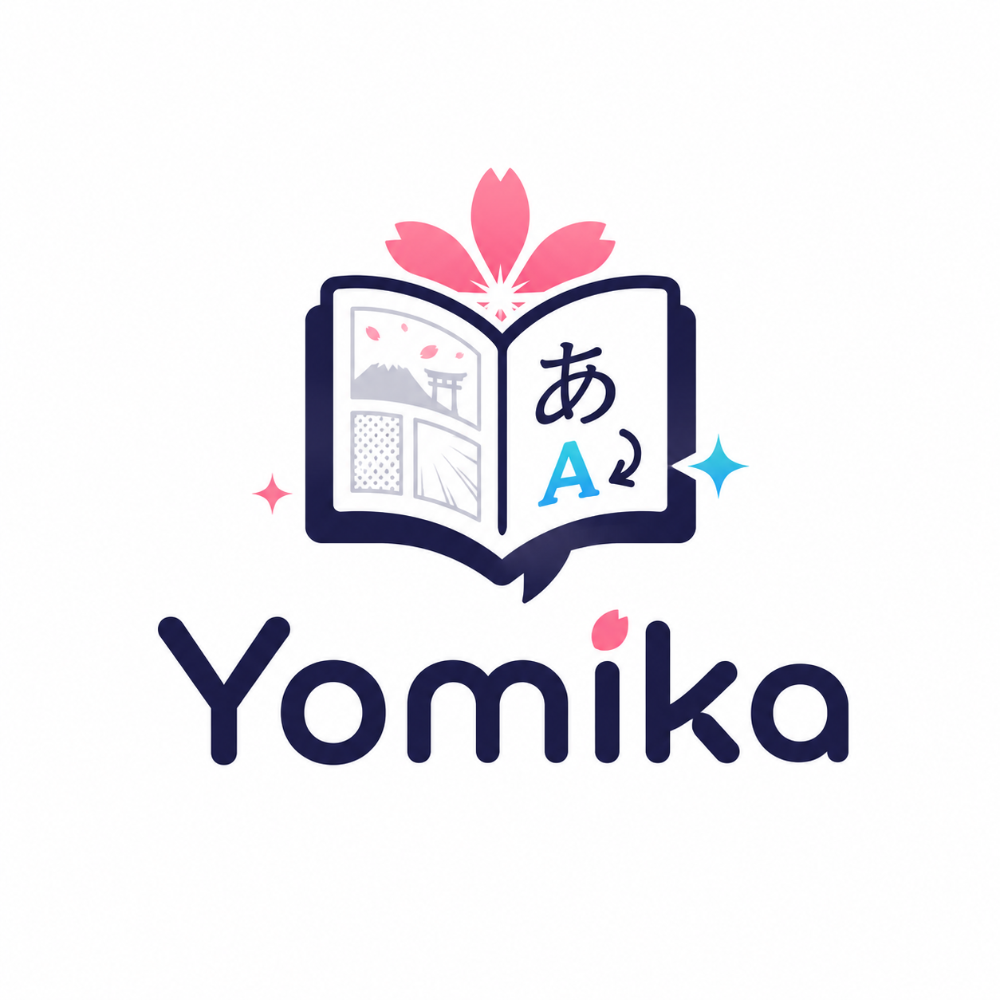

  <section class="ym-hero">
    

      

        

          新機能:
          llama.cpp-based model inference
          
            GGUF モデルを CUDA、Vulkan、Metal でローカル実行できます。
          
        

      

      

        <h1>ローカルファーストの制作パイプラインで、マンガを翻訳・組版。</h1>
        

          Yomika は Windows、macOS、Linux で OCR、クリーンアップ、翻訳、レビュー、
          書き出しまでを扱います。内蔵ビジョンパイプラインとダウンロードした LLM は端末上で実行でき、
          必要に応じてリモート翻訳プロバイダーも選べます。
        

        

          
対応するローカルモデル例

          

            sakura
            vntl-llama3
            hunyuan
            lfm2
          

        

        

          <a class="ym-download-button" href="how-to/build-from-source.md">
            ソースからビルド
          </a>
          

            Yomika は無料のオープンソースソフトウェアです。
          

        

      

    

    

      

        

          
        

      

    

  </section>

  <section class="ym-section">
    

      

        
GUI なしの運用

        <h2>ローカル Web UI やスクリプト化したページ処理が必要なときは、デスクトップウィンドウなしで Yomika を動かせます。</h2>
        

          デスクトップアプリが主な利用形態ですが、同じランタイムを headless でも動かせます。
          別マシンからのブラウザアクセス、繰り返し実行するバッチ翻訳、
          あるいは Yomika のページ単位パイプラインをそのまま使うローカル自動化に向いています。
        

      

      

        

          
Headless モード

          

            デスクトップウィンドウを開かずに Yomika を起動し、同じ翻訳ランタイムを固定ローカルポート上のブラウザセッションから使えます。
          

          <pre><code># macOS / Linux
yomika --port 4000 --headless

# Windows
yomika.exe --port 4000 --headless</code></pre>
        

        

          
Headless の用途

          

            既存のデスクトップワークフローを、スクリプト化、スケジュール実行、他のローカルツールへの公開に向いた形で使いたいときに向いています。
          

          

            ローカル Web UI
            バッチ処理
            スクリプト
            リモートデスクトップ環境
          

        

      

    

  </section>

  <section class="ym-section">
    

      

        
MCP 連携

        <h2>MCP を通じて、エージェントから同じローカル Yomika ランタイムを操作できます。</h2>
        

          Yomika には MCP サポートがあるため、デスクトップ編集、headless モード、エージェントワークフローのすべてが、
          別々のスタックに分かれず同じローカル翻訳ランタイムを共有できます。
        

      

      

        

          <h3>1 つのランタイム、複数の入口</h3>
          

            同じページパイプラインをデスクトップ UI、headless Web UI、MCP ツールで共有できるため、
            自動化だけが通常の編集セッションと別挙動になるのを防げます。
          

        

        

          <h3>エージェント向けの翻訳タスク</h3>
          

            OCR、クリーンアップ、翻訳、ページ単位の出力にアクセスする補助ツールや、
            バッチ翻訳、レビュー反復、export 作業をエージェントに任せられます。
          

        

      

    

  </section>

  <section class="ym-dev">
    

      

        
        
開発者向け

        <h2>ローカルでビルドし、同じデスクトップランタイムを自分のツールに組み込めます。</h2>
        

          Yomika は開発もしやすく、組み込みにも向いています。Bun と Rust でソースビルドし、
          安定したランタイムフラグを使い、必要に応じて headless モードや MCP をローカル自動化に再利用できます。
        

      

      

        

          

            
ビルド

            

              プロジェクトと同じ Bun / Rust ツールチェーンで、デスクトップアプリをソースからビルドできます。
            

            <pre><code>bun install --frozen-lockfile
bun run build</code></pre>
          

          

            
ランタイムフラグ

            

              デスクトップバイナリには、別のバックエンドサービスを増やさずにローカル配備や自動化へ使える実用的なフラグがあります。
            

            

              --headless
              --port
              --download
              --cpu
            

          

          

            
自動化

            

              Yomika をより大きなローカルワークフローに組み込みたいときは、
              同じページパイプラインを headless モードや MCP 経由で再利用できます。
            

            

              デスクトップアプリ
              Headless mode
              ローカル Web UI
              MCP エージェント連携
              ローカル統合
            

          

        

      

    

  </section>

